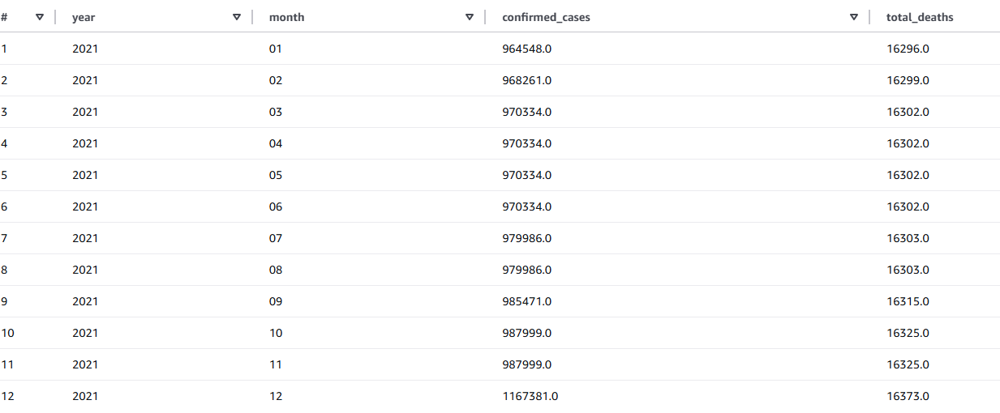
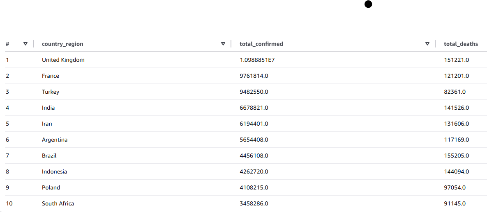
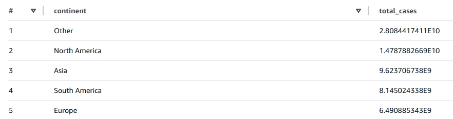

# 🦠 Análisis Global COVID-19 2021

<p align="center">
  
</p>

## 📊 Resumen del Proyecto

Este proyecto presenta un análisis exhaustivo de los datos globales de COVID-19 durante 2021, utilizando datos almacenados en AWS S3 y procesados mediante AWS Athena. El estudio incluye análisis detallados de casos, muertes, tasas de letalidad y patrones de propagación en diferentes países y regiones.

### 🎯 Objetivos
- Analizar la evolución temporal de la pandemia
- Comparar el impacto entre diferentes países y regiones
- Identificar patrones en tasas de letalidad y recuperación
- Evaluar la efectividad de diferentes respuestas sanitarias

## 🛠️ Tecnologías Utilizadas

- **Almacenamiento de Datos**: AWS S3
- **Procesamiento**: AWS Athena
- **Análisis**: Python, Pandas
- **Visualización**: Matplotlib, Seaborn
- **Entorno**: Google Colab
- **Control de Versiones**: Git/GitHub

## 📈 Análisis Realizados

1. **Evolución Temporal en España**
   - Seguimiento mensual de casos y muertes
   - Análisis de tendencias y patrones estacionales

2. **Comparativa Global**
   - Ranking de países más afectados
   - Análisis de tasas de letalidad
   - Distribución por continentes

3. **Análisis Específicos**
   - Tasas de incidencia
   - Casos activos vs recuperados
   - Correlaciones población-casos

## 🔍 Principales Hallazgos

- Patrones claros de estacionalidad en la propagación
- Diferencias significativas en tasas de letalidad entre regiones
- Correlación entre recursos sanitarios y gestión de la pandemia
- Mejora gradual en la efectividad de tratamientos

## 📊 Visualizaciones Destacadas

<details>
<summary>Ver gráficos principales</summary>

### Evolución de Casos en España


### Top 10 Países Afectados


### Distribución por Continentes

</details>

## 📁 Estructura del Proyecto

📦 COVID-Analysis
┣ 📂 docs/ # Archivos CSV de datos
┣ 📂 fotos/ # Imágenes y gráficos
┣ 📂 notebooks/ # Jupyter notebooks
┣ 📜 .gitignore
┗ 📜 README.md


## 🚀 Cómo Ejecutar el Proyecto

1. Clonar el repositorio:
```bash
git clone https://github.com/MouraAnalyst/Evolve-Analisis-Covid.git
```

2. Instalar dependencias:
```bash
pipenv install
```

3. Abrir el notebook en Google Colab o Jupyter

## 📊 Metodología

1. **Extracción de Datos**
   - Consultas SQL en AWS Athena
   - Procesamiento inicial de datos

2. **Análisis Exploratorio**
   - Limpieza y preparación de datos
   - Análisis estadístico básico

3. **Visualización**
   - Creación de gráficos informativos
   - Análisis de tendencias

## 🤝 Contribuciones

Las contribuciones son bienvenidas. Por favor, abre un issue para discutir cambios mayores.

## 📫 Contacto

</br>
[](https://www.linkedin.com/in/alex-moura-analyst/)
</br>
[](mailto:alex_gomes10@hotmail.com)
</br>

## 📜 Licencia

Este proyecto está bajo la licencia MIT - ver el archivo [LICENSE.md](LICENSE.md) para más detalles.

## 🙏 Agradecimientos

- Evolve Academy por proporcionar los datos y la infraestructura
- Profesores y mentores por su guía
- Comunidad de análisis de datos por sus recursos y herramientas

---
<p align="center">
  Desarrollado con ❤️ por Alex Moura
</p>